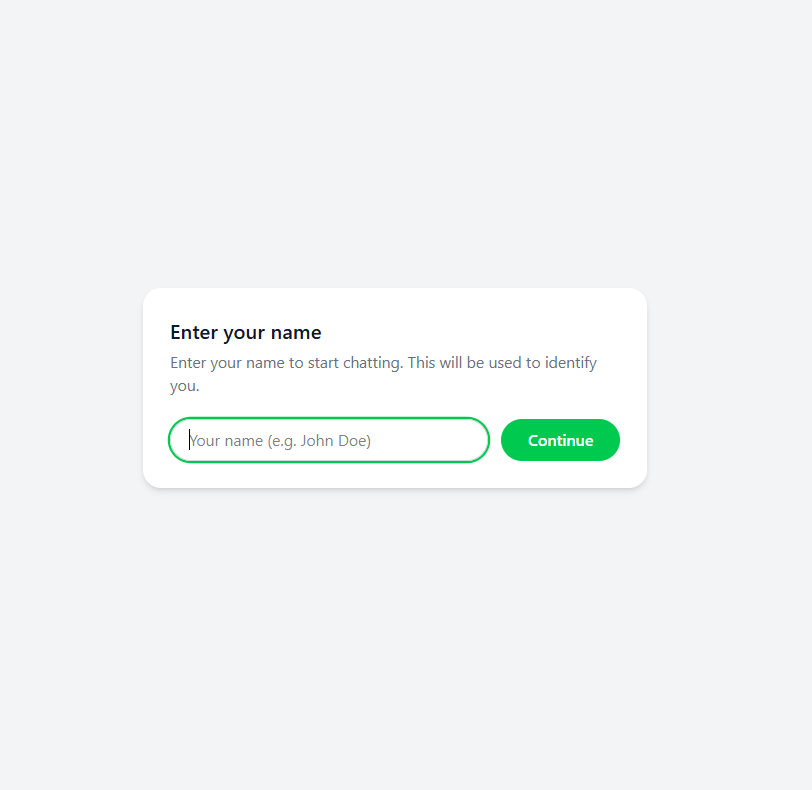
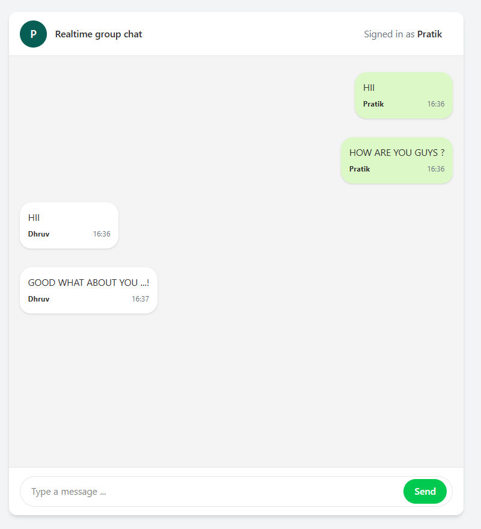
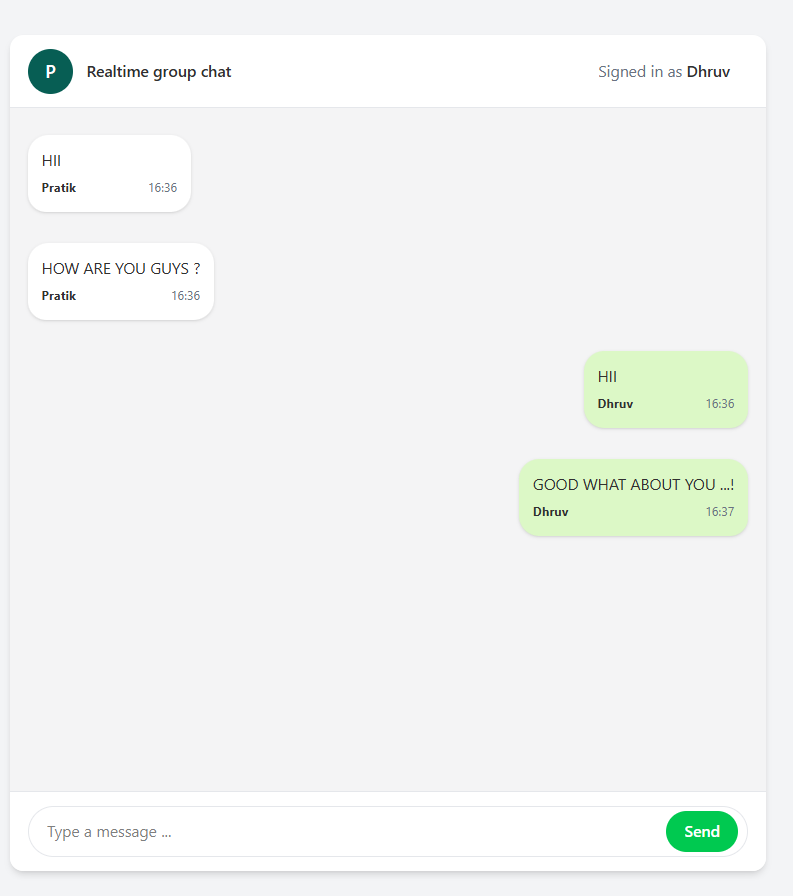

# 💬 Group Chat Real-Time Application

A **real-time group chat application** built using **Socket.IO**, where multiple users can join a single group and communicate instantly. This project demonstrates real-time bidirectional communication between clients and the server.

---

## 🚀 Features

- 🔴 Real-time messaging using **Socket.IO**
- 👥 Multiple users can join the same group
- 💬 Instant message broadcasting to all group members
- 🧑‍🤝‍🧑 includes a **real-time typing indicator** feature.
- ⚡ Fast and smooth real-time communication
- 🌐 Web-based chat interface

---

## 🛠️ Tech Stack

- **Frontend:**  Reactjs
- **Backend:** Node.js, Express.js
- **Real-Time Engine:** Socket.IO
- **Protocol:** WebSockets (via Socket.IO)

---

## 📖 How It Works

1. A user opens the application and joins a group chat.
2. The client establishes a **Socket.IO connection** with the server.
3. When a user types in the input field, a `typing` event is emitted using Socket.IO.
4. When a user sends a message:
   - The message is emitted to the server.
   - The server broadcasts the message to all users in the group.
5. All connected members instantly receive and see the message.
6. When a user joins , the group is notified in real time.

This allows **many members to chat together in one group** without refreshing the page.

---

## 📡 Socket.IO Events Used

### connection – When a user connects

### join – When a user joins the group

### message – When a user sends a message
---

## 📸 Output Screenshots

### 🖥️ Join Group Interface

### 👥 Multiple Users in One Group

### 🔔 Real-Time Messaging

---

